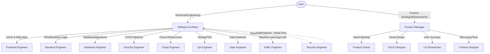

# Multi-Agent Development Guide

This document outlines the multi-agent software engineering framework used to develop and maintain the **CipherFoods** project. 

CipherFoods is built utilizing a cross-functional squad of **15 specialized AI agents** that mimic a real-world software engineering team. This agentic structure ensures domain isolation, modularity, high code quality, security compliance, and robust system architecture.

---

## 🏗️ Agentic Architecture & Collaboration

The agent team operates on a **hub-and-spoke / orchestrator-specialist delegation model**. The user interacts primarily with two main entry point agents: the **Software Architect** (for technical & engineering tasks) and the **Product Manager** (for requirements, specs, and roadmaps).

---

## 👥 Agent Directory (15 Roles)

Below is a detailed breakdown of all 15 agents configured under [.github/agents](file:///c:/Users/sai/Desktop/cipherfoods-gpt/.github/agents/), including their primary responsibilities, boundaries, and collaboration patterns.

### 1. Primary Entry Points (User-Invocable)

| Agent | Config File | Domain & Primary Focus | Collaboration / Delegation |
|---|---|---|---|
| **Software Architect** | [software-architect.agent.md](file:///c:/Users/sai/Desktop/cipherfoods-gpt/.github/agents/software-architect.agent.md) | Technical design, trade-off analysis, orchestration of code changes, and overall system quality. | Decomposes complex tasks and delegates to BE, FE, DB, DevOps, Cloud, QA, AI, and Data engineers. Audits their outputs. |
| **Product Manager** | [product-manager.agent.md](file:///c:/Users/sai/Desktop/cipherfoods-gpt/.github/agents/product-manager.agent.md) | Product discovery, user stories (INVEST), roadmaps, success metrics, and requirements (PRDs). | Decomposes product goals and delegates to UX Researcher, UI/UX Designer, Content Designer, and Product Owner. |

### 2. Engineering Specialists (Subagents)

| Agent | Config File | Role Summary | Key Constraints |
|---|---|---|---|
| **Backend Engineer** | [backend-engineer.agent.md](file:///c:/Users/sai/Desktop/cipherfoods-gpt/.github/agents/backend-engineer.agent.md) | Implements REST/GraphQL APIs, auth middleware, and core NestJS services. | Cannot modify frontend components or make direct database schema edits (must request DB Engineer). |
| **Frontend Engineer** | [frontend-engineer.agent.md](file:///c:/Users/sai/Desktop/cipherfoods-gpt/.github/agents/frontend-engineer.agent.md) | Implements client-side logic, responsive UI, state management (Zustand), and accessibility (a11y). | Cannot modify backend API controllers or cloud infra files. |
| **Database Engineer** | [database-engineer.agent.md](file:///c:/Users/sai/Desktop/cipherfoods-gpt/.github/agents/database-engineer.agent.md) | Designs SQL schemas, writes TypeORM migrations, configures Redis caching, and refactors slow queries. | Cannot modify API routes or UI code. Focuses strictly on data integrity and performance. |
| **DevOps Engineer** | [devops-engineer.agent.md](file:///c:/Users/sai/Desktop/cipherfoods-gpt/.github/agents/devops-engineer.agent.md) | Manages docker-compose, CI/CD GitHub Actions pipelines, and local development stack configs. | Cannot write application logic. Collaborates with Cloud and QA engineers. |
| **Cloud Engineer** | [cloud-engineer.agent.md](file:///c:/Users/sai/Desktop/cipherfoods-gpt/.github/agents/cloud-engineer.agent.md) | Provisions AWS services (ECS Fargate, RDS, ElastiCache, Keycloak on ECS) using Terraform. | Focuses on cloud security, IAM, networking (VPC/subnets), and infrastructure cost optimization. |
| **QA Engineer** | [qa-engineer.agent.md](file:///c:/Users/sai/Desktop/cipherfoods-gpt/.github/agents/qa-engineer.agent.md) | Writes integration and End-to-End tests, designs unit test strategies, and validates acceptance criteria. | Enforces Test-Driven Development (TDD) principles across modules. |
| **Security Engineer** | [security-engineer.agent.md](file:///c:/Users/sai/Desktop/cipherfoods-gpt/.github/agents/security-engineer.agent.md) | **Read-Only Auditor**. Reviews code for OWASP Top 10 vulnerabilities, dependency security, and JWT flaws. | **Strict Constraint**: Cannot modify any code. Must write a security report recommending fixes for other engineers to apply. |
| **Data Engineer** | [data-engineer.agent.md](file:///c:/Users/sai/Desktop/cipherfoods-gpt/.github/agents/data-engineer.agent.md) | Designs ETL pipelines, data streams, and database synchronizations for reporting. | Invoked for reporting dashboard data synchronization or bulk vendor import operations. |
| **AI/ML Engineer** | [ai-ml-engineer.agent.md](file:///c:/Users/sai/Desktop/cipherfoods-gpt/.github/agents/ai-ml-engineer.agent.md) | Implements chatbot support assistance, recommendation systems, and farmer-demand forecasting algorithms. | Invoked specifically for AI integrations, LLM pipelines, or predictive models. |

### 3. Product & Design Specialists (Subagents)

| Agent | Config File | Role Summary | Key Constraints |
|---|---|---|---|
| **UI/UX Designer** | [ui-ux-designer.agent.md](file:///c:/Users/sai/Desktop/cipherfoods-gpt/.github/agents/ui-ux-designer.agent.md) | Defines styling tokens, components layout, user flow mockups, and Tailwind configurations. | Does not write backend or application code; focuses on CSS/UI frameworks and UI assets. |
| **UX Researcher** | [ux-researcher.agent.md](file:///c:/Users/sai/Desktop/cipherfoods-gpt/.github/agents/ux-researcher.agent.md) | Collects feedback, defines user personas, maps journeys, and ensures customer-centric features. | Does not implement interfaces. Formulates user validation strategies. |
| **Content Designer** | [content-designer.agent.md](file:///c:/Users/sai/Desktop/cipherfoods-gpt/.github/agents/content-designer.agent.md) | Formulates UX copy, microcopy, transactional email templates, and application notifications. | Manages strings, localization keys, and copy tone guidelines. |
| **Product Owner** | [product-owner.agent.md](file:///c:/Users/sai/Desktop/cipherfoods-gpt/.github/agents/product-owner.agent.md) | Refines user stories, manages the backlog, validates acceptance criteria, and plan sprints. | Works directly with Product Manager and Software Architect for ticket scoping. |

---

## 🛠️ What the Agent Team Has Done So Far

Through structured collaboration, the agent squad has successfully delivered the foundation and core modules of the CipherFoods project:

### 1. Workspace Configuration & Monorepo Setup
- **Architect & DevOps** established an [Nx](https://nx.dev) monorepo containing:
  - `apps/api` (NestJS backend API)
  - `apps/web` (Next.js customer portal storefront)
  - `apps/vendor-panel` (Next.js dashboard for farmers)
  - `apps/admin-panel` (Next.js administrator manager)
  - `libs/shared` (Common Type definitions, utils, and shared schemas)

### 2. Core Authentication System ([apps/api/src/modules/auth](file:///c:/Users/sai/Desktop/cipherfoods-gpt/apps/api/src/modules/auth/))
- **Backend Engineer** implemented a production-grade authentication flow using Keycloak 24 (OIDC/OAuth2).
- Key features include: JWT verification middleware, role guard controls (Customer vs. Vendor vs. Admin), registration endpoints, and login authorization.
- **DevOps Engineer** created [setup-keycloak.ps1](file:///c:/Users/sai/Desktop/cipherfoods-gpt/scripts/setup-keycloak.ps1) to configure the development Keycloak instance automatically.

### 3. Product Catalog Engine ([apps/api/src/modules/catalog](file:///c:/Users/sai/Desktop/cipherfoods-gpt/apps/api/src/modules/catalog/))
- **Database Engineer** configured PostgreSQL with full-text search indexes (`tsvector` and `pg_trgm` extension) to support smart, fuzzy search of farmer products.
- **Backend Engineer** designed product categories, variant attributes (e.g., package weight, organic certifications), and robust CRUD operations.

### 4. Multi-Vendor Cart & Order Splitting ([apps/api/src/modules/cart](file:///c:/Users/sai/Desktop/cipherfoods-gpt/apps/api/src/modules/cart/) & [apps/api/src/modules/order](file:///c:/Users/sai/Desktop/cipherfoods-gpt/apps/api/src/modules/order/))
- **Backend Engineer** developed a shopping cart designed to hold products from multiple separate vendors (Telangana farmers).
- **Architect & Backend Engineer** implemented a split-order execution engine. When a customer pays for a single checkout:
  - The cart order is split into separate sub-orders for each participating farmer.
  - Each farmer receives their specific sub-order in their dashboard, allowing independent inventory deduction, delivery tracking (Dunzo/Porter), and commission/payout calculations.

### 5. Seeding & Database Troubleshooting
- **Database Engineer** created [seed.js](file:///c:/Users/sai/Desktop/cipherfoods-gpt/seed.js) generating realistic Telangana farming vendors and traditional catalog items.
- Fixed database linking bugs using helper scripts (e.g., [fix_vendor_products.js](file:///c:/Users/sai/Desktop/cipherfoods-gpt/fix_vendor_products.js) and [final_db_fix.js](file:///c:/Users/sai/Desktop/cipherfoods-gpt/final_db_fix.js)) to resolve catalog relation issues during testing.

---

## 🚀 How to Use the Agents

If you are using **VS Code** with the **Copilot Extensions** (or other multi-agent coding assistants like Cursor/Roo Code that support custom prompt setups):

### 1. Starting a Technical Task
When you need to build a backend API, refactor database columns, or set up a frontend view:
- **Invoke the Software Architect** (using `@Software Architect` or by pointing the agent prompt to [software-architect.agent.md](file:///c:/Users/sai/Desktop/cipherfoods-gpt/.github/agents/software-architect.agent.md)).
- Describe the engineering goal or problem.
- **Execution Flow**:
  1. The Architect will analyze the request and outline an architecture.
  2. The Architect will call the **Database Engineer** to write the required SQL schema migration files.
  3. The Architect will call the **Backend Engineer** to implement controllers, services, and DTOs.
  4. The Architect will call the **QA Engineer** to write/run test cases.
  5. The Architect reviews the code changes and presents the final solution to you.

### 2. Starting a Product Design or Planning Task
When you need to define how a new feature works, list user stories, or finalize copy:
- **Invoke the Product Manager** (using `@Product Manager` or loading [product-manager.agent.md](file:///c:/Users/sai/Desktop/cipherfoods-gpt/.github/agents/product-manager.agent.md)).
- Describe what user need you want to address.
- **Execution Flow**:
  1. The PM defines the user stories and OKRs.
  2. The PM invokes the **UX Researcher** to outline user journeys.
  3. The PM invokes the **UI/UX Designer** to produce CSS layout structures or design tokens.
  4. The PM invokes the **Content Designer** to verify notifications and error strings.
  5. The PM synthesizes these into a handoff-ready PRD.

### 3. Running Subagents Manually (For Advanced Users)
You can directly call a specialist if you have a highly isolated task:
- To run a database index check: Invoke the **Database Engineer** ([database-engineer.agent.md](file:///c:/Users/sai/Desktop/cipherfoods-gpt/.github/agents/database-engineer.agent.md)).
- To audit security configurations: Invoke the **Security Engineer** ([security-engineer.agent.md](file:///c:/Users/sai/Desktop/cipherfoods-gpt/.github/agents/security-engineer.agent.md)).

---

## 🔒 Safety and Security Guardrails

The team uses the following guidelines to protect the code:
1. **Isolated Contexts**: Agents are restricted to their domains. The `Frontend Engineer` cannot rewrite your Postgres query.
2. **Review Validation**: The orchestrator must audit all subagent edits before presentment.
3. **No Direct Production Deployments**: DevOps and Cloud agents create infrastructure scripts (Terraform, CI/CD YAML) but do not execute deployments without explicit human verification.
4. **Read-Only Security**: The `Security Engineer` has strict read-only tool permissions to ensure it cannot introduce security bypass vulnerabilities in code edits.
